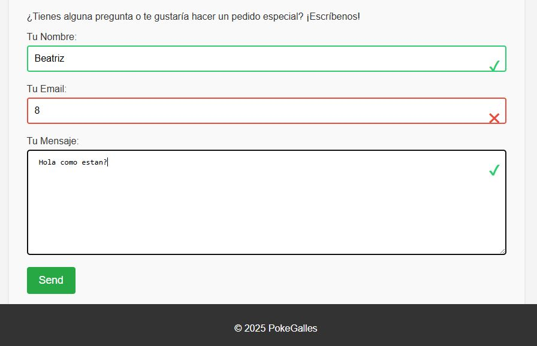
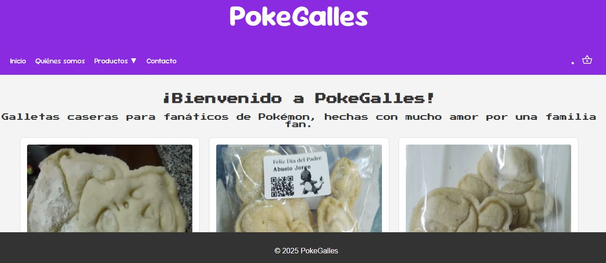
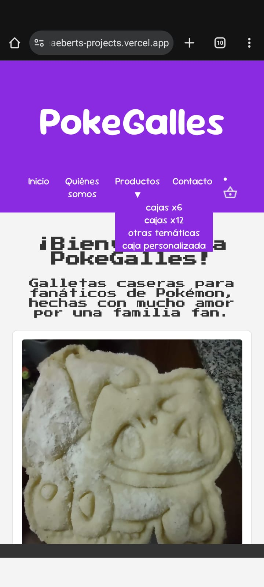
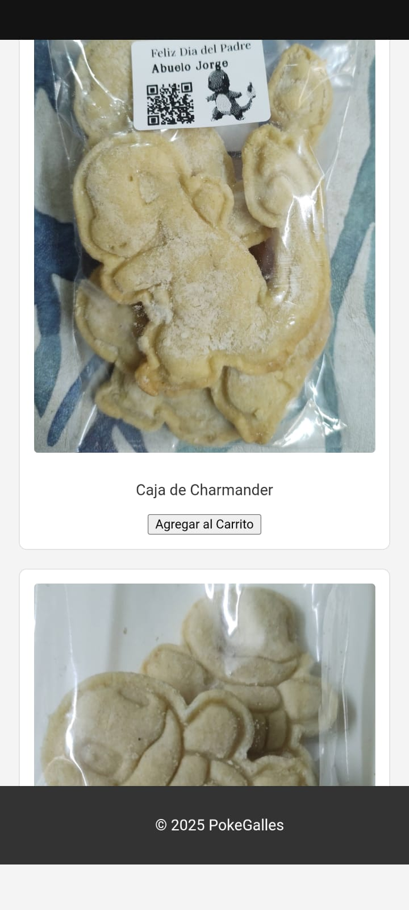

<h1> Proyecto de Sitio Web</h1>
<h3> Este proyecto es para el Curso Front End con HTML, CSS y JavaScript, de Talento Tech Adultos, del Gobierno de la Ciudad de Buenos Aires. </h3>

* Se trata de un sitio web de venta y pedido de productos, en este caso de galletitas tematicas.
* Tiene un menú de navegación que permite volver a la pantalla de inicio, ver información de la página, ver un listado de productos, ponerse en contacto, y el enlace al carrito de compras (con el icono).
* El formulario de contacto fue realizado con Formspree (Formspree.io) y agregandole verificación de datos con JavaScript, como es solicitado para la entrega del Curso Front End.
* El carrito de compras mantiene la información en el navegador con LocalStorage como es solicitado para la entrega del Curso Front End.

<h4> Visualización en dispositivos medianos (notebook, monitores) </h4>

<h5> Aspecto de las validaciones visualmente</h5>

<h4>Visualización en dispositivos pequeños</h4>

Se utilizaron herramientas de consulta como la documentación instructiva aportada por el curso,

el asistente Jules de Google para construir la base de algunas funciones, y el hosting Vercel para el deploy.

El curso Front End de Talento Tech finalizo en Julio 2025, se seguira desarrollando este proyecto después del curso.

*Queda preparar la Base de Datos de Productos, posiblemente NoSQL para manejar las imagenes con los datos*
